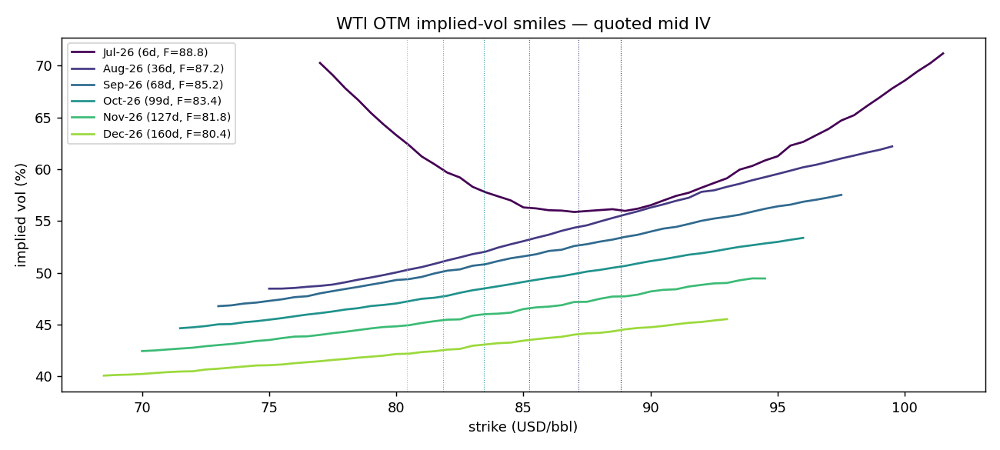
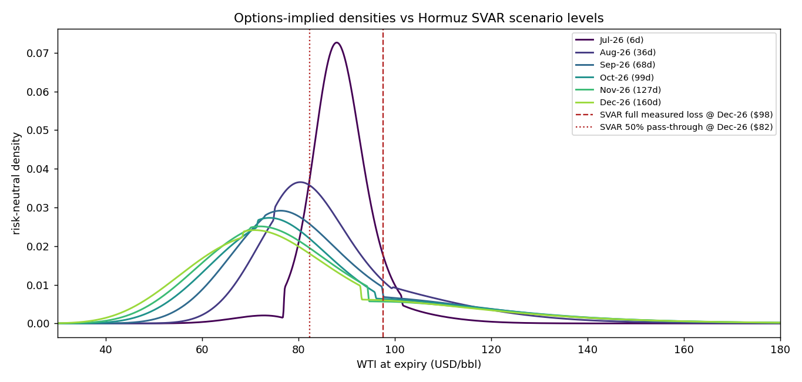

# Options-Implied Tail Risk — WTI Futures Options

*Auto-generated by `scripts/options_analysis.py` from the option-chain
snapshot in `data/raw/Oil_Futures_Options.xlsx` (Breeden-Litzenberger
risk-neutral densities; smile splined, held flat beyond quoted wings).*

## Tail table (risk-neutral)

| expiry   |   days |   future |   rn_mean |   P(>$100) |   P(>$120) |   P(>$150) |    q05 |    q50 |     q95 |     q99 |
|:---------|-------:|---------:|----------:|-----------:|-----------:|-----------:|-------:|-------:|--------:|--------:|
| Jul-26   |      6 |    88.83 |    88.83  |      0.052 |      0.003 |      0     | 79.076 | 88.44  | 100.095 | 111.49  |
| Aug-26   |     36 |    87.16 |    87.16  |      0.171 |      0.048 |      0.004 | 67.406 | 83.778 | 119.448 | 139.675 |
| Sep-26   |     68 |    85.22 |    85.217 |      0.179 |      0.073 |      0.013 | 60.714 | 80.64  | 127.188 | 154.266 |
| Oct-26   |     99 |    83.43 |    83.417 |      0.181 |      0.08  |      0.017 | 56.099 | 78.335 | 129.69  | 159.902 |
| Nov-26   |    127 |    81.83 |    81.805 |      0.173 |      0.079 |      0.019 | 53.302 | 76.689 | 129.991 | 161.858 |
| Dec-26   |    160 |    80.41 |    80.378 |      0.17  |      0.076 |      0.018 | 50.644 | 75.427 | 128.989 | 161.139 |

## Market-implied probability of the SVAR scenario levels

Scenario paths converted to nominal USD at a 2.5%/yr CPI assumption:

| expiry   |   future |   level: 25% pass-through |   P(>= 25% pass-through) |   level: 50% pass-through |   P(>= 50% pass-through) |   level: full measured loss |   P(>= full measured loss) |
|:---------|---------:|--------------------------:|-------------------------:|--------------------------:|-------------------------:|----------------------------:|---------------------------:|
| Jul-26   |    88.83 |                    77.162 |                    0.974 |                    82.96  |                    0.844 |                      95.895 |                      0.121 |
| Aug-26   |    87.16 |                    75.739 |                    0.783 |                    81.46  |                    0.586 |                      94.233 |                      0.239 |
| Sep-26   |    85.22 |                    75.612 |                    0.645 |                    81.786 |                    0.47  |                      95.69  |                      0.215 |
| Oct-26   |    83.43 |                    76.04  |                    0.561 |                    82.774 |                    0.397 |                      98.084 |                      0.193 |
| Nov-26   |    81.83 |                    75.934 |                    0.518 |                    82.541 |                    0.375 |                      97.532 |                      0.186 |
| Dec-26   |    80.41 |                    75.581 |                    0.498 |                    82.293 |                    0.359 |                      97.559 |                      0.184 |

## Reading

- Implied vols are at crisis levels (40–65% vs ~30% in calm markets);
  the futures curve is steeply backwardated — the market prices the
  disruption as real but partially resolving over 2026.
- The right tail is heavy and grows with maturity: P(>$120) peaks
  around 7% at ~3–5 months; the 99th percentile reaches ~$150+.
- The left tail is also fat (5th percentile near $50 by year-end):
  the market simultaneously prices resolution + demand destruction.
- Right/left tail-width ratio (q95 vs q05 distance from F): Jul-26 1.15, Aug-26 1.63, Sep-26 1.71, Oct-26 1.69, Nov-26 1.69, Dec-26 1.63.

## Caveats

- These are *risk-neutral* probabilities: they embed risk premia and
  overstate physical probabilities most in feared states — treat
  P(>$X) as an upper bound.
- Quoted strikes stop near $95–100; beyond them the smile is held
  flat. With a typical upward call skew this likely *understates*
  the extreme right tail. Request wider wings in the next export.
- Single evening snapshot (Australia time); densities move with
  every headline in a crisis. Re-export and re-run for fresh reads.