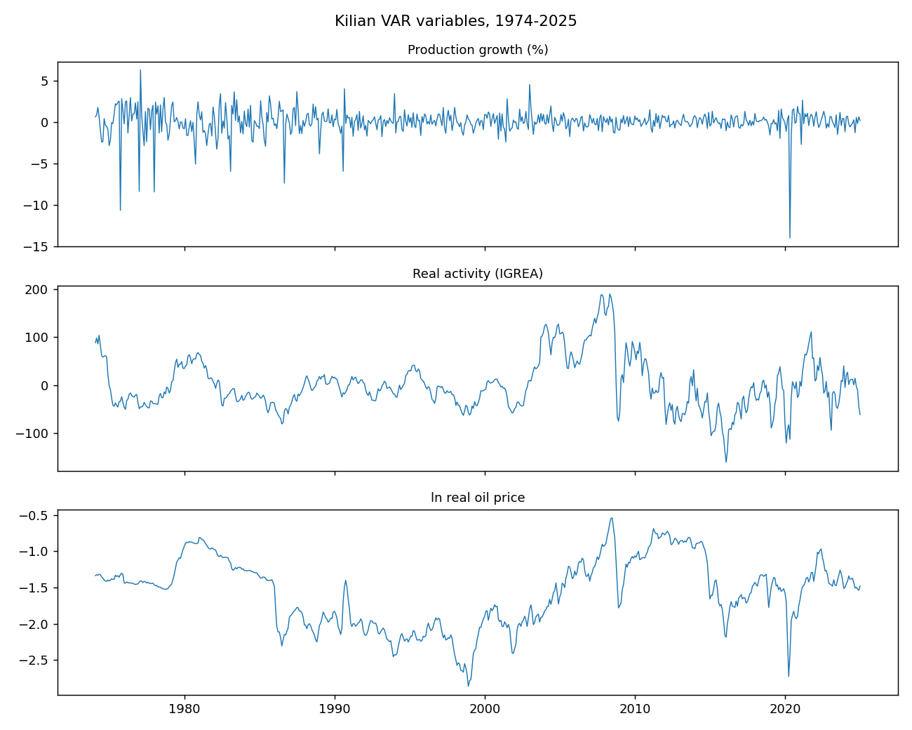
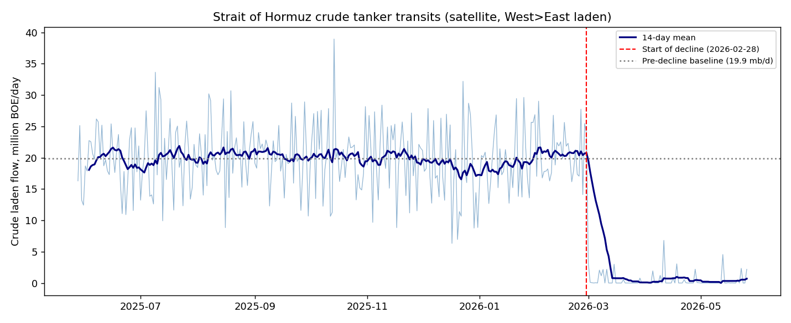
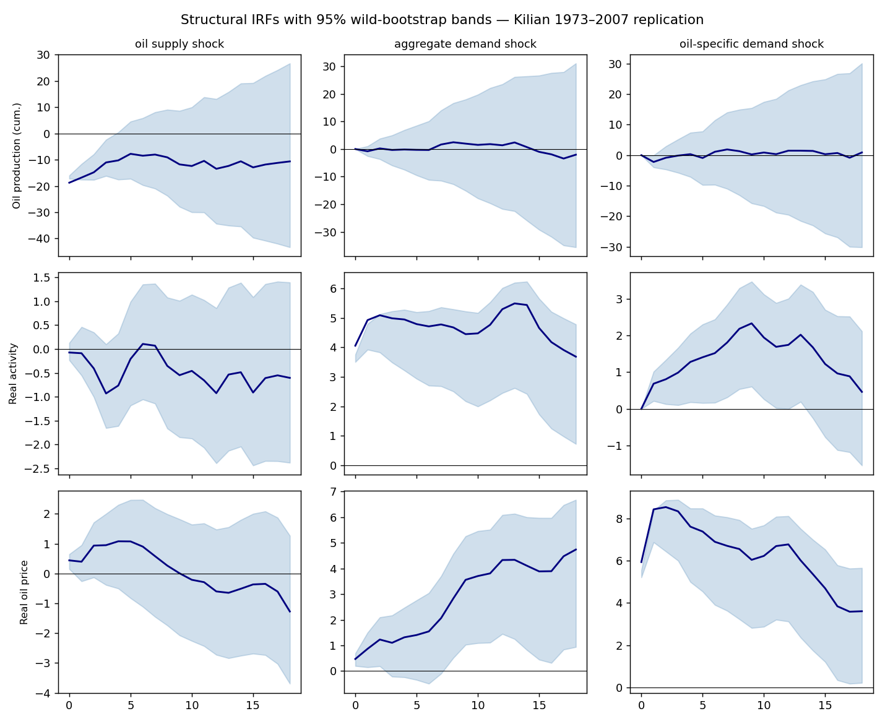
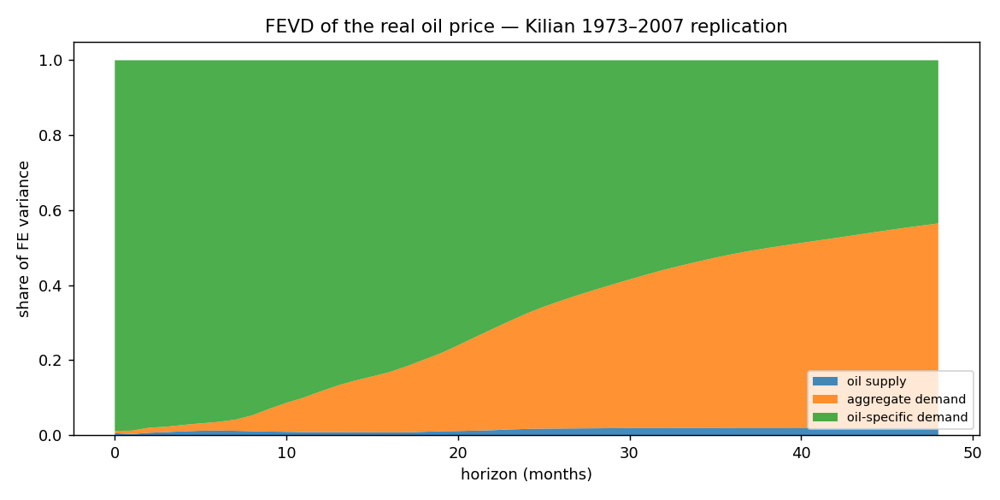
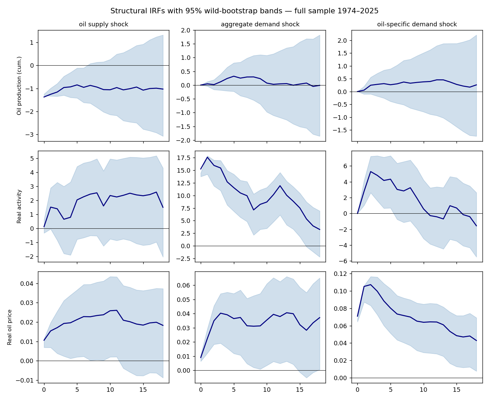
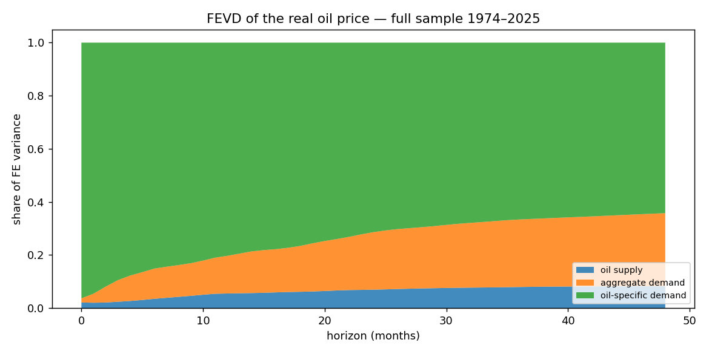
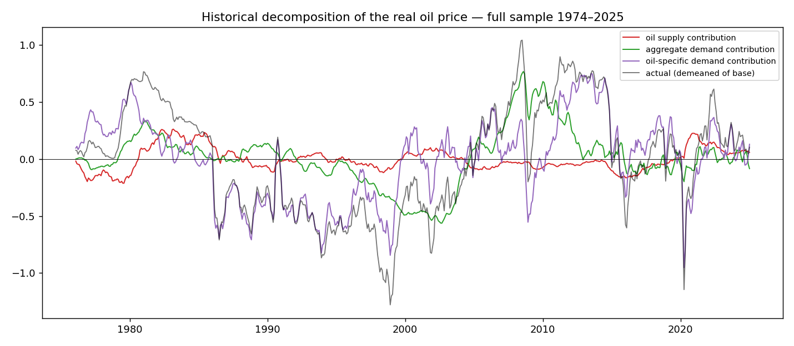
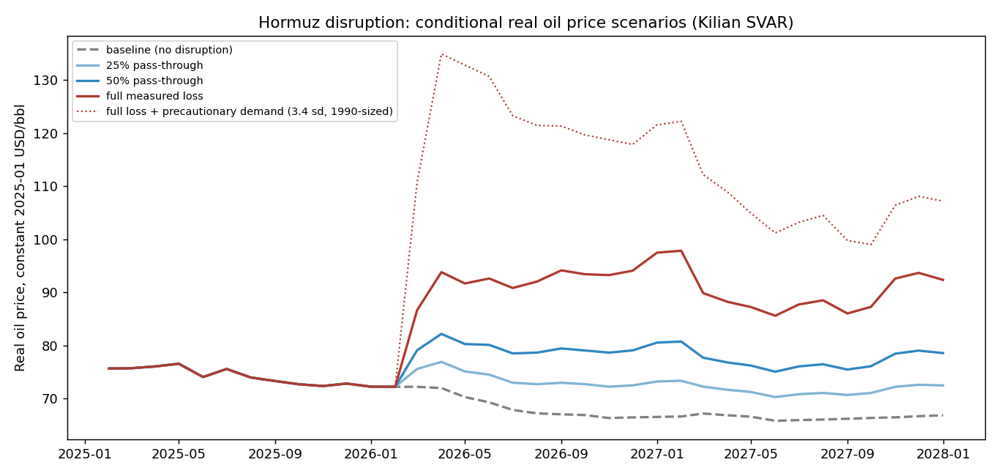
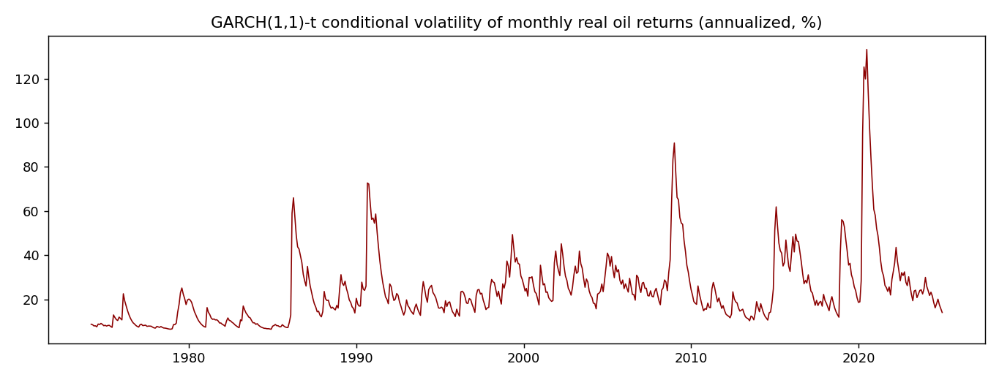

# Oil Price Forecasting — Results

*Auto-generated by `scripts/run_all.py`. Figures in `figures/`.*

## 1. Data
- Kilian VAR dataset: monthly 1974-02 to 2025-01 (612 obs).
- Kilian (2009) original replication data: 1973-02 to 2007-12.
- Hormuz satellite transits: daily 2025-05-28 to 2026-05-26 (Boil_1.xlsx).

## 2. Hormuz disruption — measured supply shock

- Pre-decline baseline (West>East laden crude): **19.9 million BOE/day** (workbook: 19.88; match 99.9%).
- Post-decline mean: 0.74 mb/d — a **96.3% collapse** from 2026-02-28.
- Cumulative crude shortfall over 88 observed days: **1.69 billion barrels** (workbook 94-day figure reproduced to 98.6%).
- Days of consumption the shortfall represents: China 83d, USA 105d, EU 161d, Global 16d.
- Monthly aggregates incl. the implied inventory-draw series (the
  Kilian-Murphy ΔInv proxy) are in `data/processed/hormuz_monthly.csv`,
  keyed to merge onto the VAR dataset once post-2025 prices are added.

## 3. Kilian (2009) replication, 1973–2007 — validation gate

FEVD of the real price (shares):

|   horizon |   oil supply |   aggregate demand |   oil-specific demand |
|----------:|-------------:|-------------------:|----------------------:|
|         1 |        0.003 |              0.009 |                 0.988 |
|         6 |        0.012 |              0.023 |                 0.964 |
|        12 |        0.008 |              0.109 |                 0.883 |
|        18 |        0.009 |              0.192 |                 0.799 |

Demand shocks (aggregate + oil-specific) dominate; supply explains little —
matching the published result. Gate **passed**.

## 4. Full-sample SVAR, 1974–2025

FEVD of the real price (shares):

|   horizon |   oil supply |   aggregate demand |   oil-specific demand |
|----------:|-------------:|-------------------:|----------------------:|
|         1 |        0.021 |              0.034 |                 0.945 |
|         6 |        0.035 |              0.114 |                 0.851 |
|        12 |        0.055 |              0.142 |                 0.803 |
|        18 |        0.062 |              0.173 |                 0.766 |

## 5. Hormuz scenarios — conditional price forecasts

Peak real-price uplift vs the no-disruption baseline:

| scenario           |   peak_price_uplift_pct | peak_month   |   uplift_12m_after_shock_pct |
|:-------------------|------------------------:|:-------------|-----------------------------:|
| 25% pass-through   |                  10.075 | 2027-02      |                        8.412 |
| 50% pass-through   |                  21.166 | 2027-02      |                       17.531 |
| full measured loss |                  46.811 | 2027-02      |                       38.136 |

With a 1990-Gulf-War-sized precautionary demand shock (3.4 sd) layered on the full measured loss:

| scenario           |   peak_price_uplift_pct | peak_month   |   uplift_12m_after_shock_pct |
|:-------------------|------------------------:|:-------------|-----------------------------:|
| 25% pass-through   |                  54.771 | 2026-05      |                       25.804 |
| 50% pass-through   |                  65.397 | 2026-05      |                       36.387 |
| full measured loss |                  88.885 | 2026-05      |                       60.297 |

**Caveats.** The measured transit loss (~20–24% of world production) is
an order of magnitude beyond any shock in the estimation sample; the
linear VAR extrapolates, so the full-loss path is the model's upper
bound, not a point prediction. The estimation sample ends 2025-01, so
scenario paths ride on a 13-month unconditional forecast before the
shocks hit; once spot prices through 2026 are fetched
(`DATA_REQUEST_PROMPT.md`), re-estimate and validate against the
realized Feb–May 2026 move.

## 6. Out-of-sample evaluation (recursive, 1992→2025)

MSPE ratio vs no-change (<1 beats the random walk), Diebold-Mariano
p-value, directional accuracy:

|                                  |   mspe_ratio |   dm_pvalue |   directional_accuracy |       n |
|:---------------------------------|-------------:|------------:|-----------------------:|--------:|
| (1, 'no-change')                 |        1.000 |     nan     |                nan     | 396.000 |
| (1, 'AR(1) returns')             |        0.859 |       0.207 |                  0.583 | 396.000 |
| (1, 'VAR(24)')                   |        1.045 |       0.664 |                  0.563 | 396.000 |
| (1, 'supply-demand regression')  |        1.012 |       0.417 |                  0.513 | 396.000 |
| (1, 'combination')               |        0.882 |       0.028 |                  0.588 | 396.000 |
| (3, 'no-change')                 |        1.000 |     nan     |                nan     | 394.000 |
| (3, 'AR(1) returns')             |        1.081 |       0.360 |                  0.574 | 394.000 |
| (3, 'VAR(24)')                   |        1.326 |       0.000 |                  0.525 | 394.000 |
| (3, 'supply-demand regression')  |        1.027 |       0.192 |                  0.510 | 394.000 |
| (3, 'combination')               |        1.013 |       0.656 |                  0.564 | 394.000 |
| (6, 'no-change')                 |        1.000 |     nan     |                nan     | 391.000 |
| (6, 'AR(1) returns')             |        1.110 |       0.067 |                  0.540 | 391.000 |
| (6, 'VAR(24)')                   |        1.435 |       0.003 |                  0.506 | 391.000 |
| (6, 'supply-demand regression')  |        1.066 |       0.222 |                  0.440 | 391.000 |
| (6, 'combination')               |        1.064 |       0.090 |                  0.514 | 391.000 |
| (12, 'no-change')                |        1.000 |     nan     |                nan     | 385.000 |
| (12, 'AR(1) returns')            |        1.094 |       0.090 |                  0.517 | 385.000 |
| (12, 'VAR(24)')                  |        1.378 |       0.043 |                  0.527 | 385.000 |
| (12, 'supply-demand regression') |        1.118 |       0.092 |                  0.416 | 385.000 |
| (12, 'combination')              |        1.079 |       0.165 |                  0.535 | 385.000 |

Benchmark definition note: this uses monthly-average prices (the
series' construction); Benyo et al. (2026) show edges can shrink under
an end-of-month benchmark — re-check when daily data is fetched.

## 7. Volatility (separate from the level forecast)

GARCH(1,1) with Student-t innovations (df ≈ 5.3);
12-month annualized vol forecast (%):

|             |      1 |      2 |      3 |      4 |      5 |      6 |      7 |      8 |      9 |     10 |     11 |     12 |
|:------------|-------:|-------:|-------:|-------:|-------:|-------:|-------:|-------:|-------:|-------:|-------:|-------:|
| ann_vol_pct | 16.628 | 16.945 | 17.256 | 17.561 | 17.861 | 18.157 | 18.447 | 18.733 | 19.015 | 19.293 | 19.567 | 19.837 |

## 8. Inactive models awaiting external data

EIA STEO regression, restricted gasoline-spread model, and the
futures benchmark are coded and switch on automatically when the
files specified in `DATA_REQUEST_PROMPT.md` appear in `data/external/`.

Current status:

| file                         | present   | description                                                                           |
|:-----------------------------|:----------|:--------------------------------------------------------------------------------------|
| spot_prices_monthly.csv      | False     | Monthly average Brent & WTI spot, USD/bbl, 1987-01 .. latest                          |
| us_inventories_monthly.csv   | False     | Monthly US total petroleum stocks (crude + products, incl. SPR excluded), million bbl |
| oecd_inventories_monthly.csv | False     | Monthly OECD commercial petroleum stocks, million bbl                                 |
| gasoline_monthly.csv         | False     | Monthly US conventional gasoline spot, USD/bbl (USD/gal x 42)                         |
| futures_curve_monthly.csv    | False     | Month-end CL and BZ futures settles by months-ahead (1..24)                           |
| world_production_monthly.csv | False     | Monthly world crude production, thousand bbl/day, through latest                      |
| cpi_monthly.csv              | False     | US CPI (CPIAUCSL), monthly, through latest                                            |
| igrea_monthly.csv            | False     | Kilian/Dallas Fed IGREA index, monthly, through latest                                |